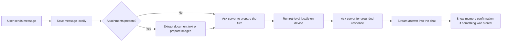
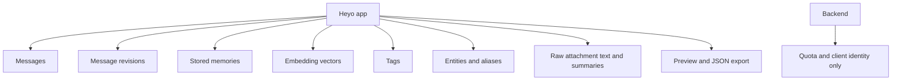
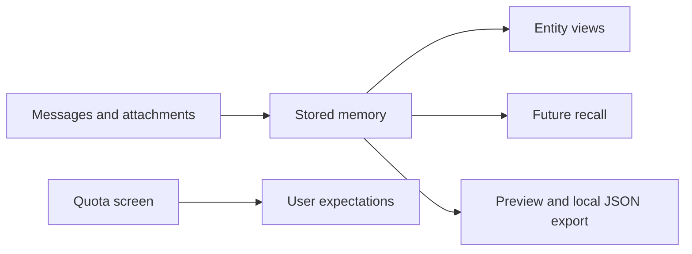

# Heyo App

Heyo is a memory-first chat app that feels simple on the surface and disciplined underneath. The user sees one continuous conversation, but the app is quietly deciding whether a message should be stored as memory, answered as a question, clarified, or treated as both. The result is a product that feels low-friction like a messenger, while still building a reliable personal memory system in the background.

This app is the product's real home. Messages, memories, vectors, entity views, attachments, edits, soft deletes, and exportable history all live on the device. The server helps Heyo reason, but it does not become the user's memory vault.

## What Heyo Feels Like

The experience is built around one linear chat, not branching threads. A user can drop in a fact like "Rita's instagram handle is @rita" and get a quiet confirmation instead of a noisy reply. If the message is ambiguous, Heyo asks whether it should store the message or answer it. If the message does both, Heyo stores the memory and answers the question in the same turn.

Users can edit messages, and the newest edit becomes the canon version without losing the older vector history behind it. Users can also soft delete both their own messages and assistant replies. Deleted material disappears from normal recall, but can still be reached in the specific cases where deleted or exhausted memory retrieval is allowed.

The app also gives users entity pages, attachment-backed memory, quota visibility, and preview-first export without changing the main chat into a busy control panel.

## Feature Snapshot

| Feature | What it means in practice |
| --- | --- |
| Local-first memory | The device keeps the real memory system, not the cloud |
| Grounded recall | Answers are built from retrieved local evidence, not freeform guessing |
| Entity pages | People, places, and topics become browsable views over linked memories |
| Attachment ingestion | Documents and images can become searchable memory with grounded summaries |
| Edit and soft delete | Users can revise canon history without hard-deleting the underlying memory traces |
| Quota awareness | The app shows remaining daily server-assisted usage clearly |
| Local export | The user can preview and save a full JSON copy of local data |

## How A Conversation Flows

Why this matters: Heyo keeps the visible experience fast and simple while limiting server round trips and preserving local control over the memory layer.

## How Memory Lives On Device

The phone or desktop app keeps the durable record of the conversation. That includes the visible chat, the memory records used for retrieval, the vectors used for semantic search, the tags and entities used for narrowing context, and the raw attachment text needed for literal document lookup.

This is the privacy boundary that defines Heyo. The server helps classify, plan, summarize, and answer, but it does not own the user's memory corpus.

## How Heyo Decides What To Do

Heyo treats each incoming message as a memory operation before it treats it as a generic chat prompt. In business terms, that means the system first asks what the user is trying to accomplish:

| Situation | Product behavior |
| --- | --- |
| Memory only | Store it quietly and show confirmation |
| Question | Retrieve evidence and answer |
| Ambiguous note | Ask whether to store or answer |
| Mixed message | Store the memory part and answer the question part |
| Sensitive or moral content | Stay brief, non-judgmental, and still preserve helpful context |

This keeps the assistant from overtalking. Heyo is designed to help the user offload life, not to reply to every line out of habit.

## How Search And Recall Work

Heyo uses several retrieval techniques, but the product experience remains simple. Exact lookups lean on keyword search. Emotional and reflective queries lean on semantic search. Entity-based questions blend filtering and reranking. Recency matters, but only after relevance is established. Deleted material stays out of normal recall unless the plan explicitly allows fallback.

Why this matters: the app can answer with continuity and precision without sending the user's full memory base to the server.

## Attachments, Entities, And Export

Documents are treated as memory sources, not just files. TXT, MD, DOCX, and PDF text are extracted locally. Raw text stays on the device for literal or fuzzy search later, while only the summary is embedded. Images can be inspected through a multimodal provider, capped at ten per request, and turned into grounded memory summaries without adding OCR complexity.

Entities are lightweight views over memory. A name like Rita can begin as a soft entity, become promoted after repeated references, and gain a grounded summary only when enough new linked memory has accumulated. That makes entities useful as a navigation surface without letting them drift away from the underlying truth.

Export follows the same trust model. The user first sees a readable JSON preview, then saves the full local snapshot to the device. The app also shows the daily quota that governs server-assisted reasoning, so limits are explicit instead of surprising.

Why this matters: Heyo turns everyday chat, uploaded material, and personal context into one coherent private memory system that the user can inspect and take with them.

## Operator Notes

Run:
`flutter pub get`
`flutter run`

Check:
`flutter analyze`
`flutter test --no-pub`
