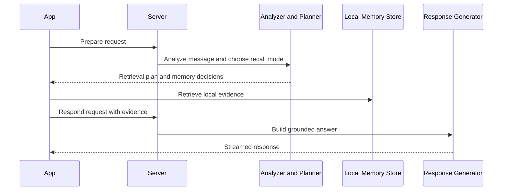
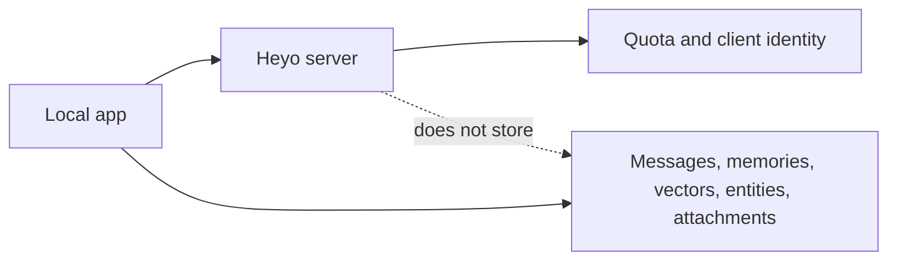

# Heyo Server

The Heyo server is the reasoning and orchestration layer behind the product. It does not store the user's chat history or memory base. Instead, it helps the app decide what kind of memory operation is happening, which retrieval strategy should be used, how a grounded answer should be phrased, when an entity summary should be refreshed, how attachments should be interpreted, and whether the daily quota has room for another assisted request.

This keeps the intelligence flexible while keeping the user's memory corpus local.

## What The Server Does

| Capability | What it does for the product |
| --- | --- |
| Provider abstraction | Lets Heyo swap generation providers without changing the app model |
| EmbeddingGemma embeddings | Gives one consistent embedding layer for memory and attachment summaries |
| Prepare analysis | Classifies the message and returns a retrieval plan |
| Respond generation | Produces grounded replies from retrieved evidence |
| Entity summary | Refreshes entity pages from linked memories only |
| Attachment inspection | Turns documents and images into grounded summary memories |
| Shared quota enforcement | Limits server-assisted usage across all major endpoints |

## How A Request Moves Through The Backend

Why this matters: Heyo gets server-side reasoning without handing over the full private memory base.

## How The Backend Thinks

The backend is built around one core idea: every incoming message is a memory operation, not just a chat prompt. The first job is to decide whether the user is storing a memory, asking a question, doing both, or requiring clarification. From there, the backend selects the cheapest reliable retrieval strategy for that situation instead of using one generic search path for everything.

That means exact mention questions are handled differently from reflective emotional questions. Person-focused recall is handled differently from quoted lyric lookup. The result is better grounding, lower waste, and more predictable behavior.

## Six Recall Modes

| Recall mode | Signal | Retrieval method | Answer style |
| --- | --- | --- | --- |
| Emotional recall | Mood or feeling language like happy, proud, calm | Tag and vector recall with dedupe | Grouped memory summary |
| Entity recall | Named person, place, or thing | Entity filter plus hybrid reranking | Chronological focus on that entity |
| Exact mention lookup | Literal phrasing such as "when did I mention..." | Keyword-first search | Dates and matching context |
| Quoted text lookup | Quoted phrase or remembered fragment | Keyword plus vector rerank | Best matching full stored memory |
| Thematic reflection | Change-over-time language such as "this year" or "grown" | Time-aware hybrid retrieval | Compare earlier and later patterns |
| Open reflective query | Broad introspection such as "why do I keep feeling stuck?" | Vector-led semantic recall | Pattern synthesis grounded in memory |

Why this matters: the system chooses retrieval based on the user's real intent instead of forcing every question through the same search pattern.

## Provider And Embedding Strategy

Generation is intentionally pluggable. Heyo can use Gemini, OpenAI, Claude, or Ollama for response generation and multimodal inspection through one normalized provider layer. Embeddings are kept separate on purpose, using one fixed embedding model so memory ranking stays consistent even if the generation provider changes later.

This gives the product operational flexibility without making memory quality drift every time a provider choice changes.

## Quota And Trust Boundary

The server enforces one shared daily quota across prepare, respond, entity summary, and attachment inspection. Accepted requests consume quota. Invalid requests do not. This makes the quota predictable from a product perspective because the user is spending against one clear pool of assisted reasoning rather than a hidden set of separate counters.

The trust boundary is equally clear. The server stores quota and minimal client identity state. It does not store the user's message history, memory graph, vectors, or raw document corpus. Those remain on the device.

Why this matters: Heyo can stay useful and flexible in the cloud while keeping the personal memory layer under user control.

## API At A Glance

| Endpoint | Product role |
| --- | --- |
| `GET /health` | Confirms the backend is alive |
| `GET /api/quota` | Returns the current daily usage snapshot |
| `POST /api/chat/prepare` | Decides what the message means and how retrieval should work |
| `POST /api/chat/respond` | Turns retrieved evidence into a grounded streamed answer |
| `POST /api/entities/summarize` | Refreshes an entity summary from linked memories |
| `POST /api/attachments/inspect` | Produces grounded summaries for documents and images |

## Operator Notes

Environment:
`HEYO_GENERATION_PROVIDER`
`HEYO_GENERATION_MODEL`
`HEYO_DATABASE_URL`
provider API keys for Gemini, OpenAI, Claude, or Ollama

Run:
`uvicorn app.main:app --reload`

Check:
`python -m pytest`
